AbsolutSin-ema is a **desktop app for managing contacts, optimized for use via a Command Line Interface** (CLI) while still having the benefits of a Graphical User Interface (GUI). If you can type fast, AbsolutSin-ema can get your contact management tasks done faster than traditional GUI apps.

* Table of Contents
{:toc}

--------------------------------------------------------------------------------------------------------------------

## Quick start

1. Ensure you have Java `17` or above installed in your Computer. 
   **Mac users:** Ensure you have the precise JDK version prescribed [here](https://se-education.org/guides/tutorials/javaInstallationMac.html).

1. Download the latest `.jar` file from [here](https://github.com/se-edu/addressbook-level3/releases).

1. Copy the file to the folder you want to use as the _home folder_ for your AbsolutSin-ema.

1. Open a command terminal, `cd` into the folder you put the jar file in, and use the `java -jar absolutsinema.jar` command to run the application. 
   A GUI similar to the below should appear in a few seconds. Note how the app contains some sample data. 
   

5. Type the command in the command box and press Enter to execute it. For example, typing **`help`** and pressing Enter will open the help window.
   Here are some example commands you can try:

   * `list` : Lists all contacts.

   * `add n/John Doe p/98765432 e/johnd@example.com w/johndoe.com b/100` : Adds a contact named `John Doe` to the AbsolutSin-ema with a cost of 100.

   * `delete 3` : Deletes the 3rd contact shown in the current list.

   * `undo` : Undoes the most recent add, delete, edit, or clear command.

   * `clear all` : Deletes all contacts and parties.

   * `exit` : Exits the app.

1. Refer to the [Features](#features) below for details of each command.

--------------------------------------------------------------------------------------------------------------------

## Features

**:information_source: Notes about the command format:** 

* Words in `UPPER_CASE` are the parameters to be supplied by the user. 
  e.g. in `add n/NAME`, `NAME` is a parameter which can be used as `add n/John Doe`.

* Items in square brackets are optional. 
  e.g `n/NAME [t/TAG]` can be used as `n/John Doe t/friend` or as `n/John Doe`.

* Items with `…`​ after them can be used multiple times including zero times. 
  e.g. `[t/TAG]…​` can be used as ` ` (i.e. 0 times), `t/friend`, `t/friend t/family` etc.

* Parameters can be in any order. 
  e.g. if the command specifies `n/NAME p/PHONE_NUMBER`, `p/PHONE_NUMBER n/NAME` is also acceptable.

* Extraneous parameters for commands that do not take in parameters (such as `help`, `list`, `exit`) will be ignored. 
  e.g. if the command specifies `help 123`, it will be interpreted as `help`.

* If you are using a PDF version of this document, be careful when copying and pasting commands that span multiple lines as space characters surrounding line-breaks may be omitted when copied over to the application.

### Viewing help : `help`

Shows a message explaining how to access the help page.

Format: `help`

### Adding a person: `add`

Adds a person to the AbsolutSin-ema.

Format: `add n/NAME p/PHONE_NUMBER e/EMAIL [w/WEBSITE] b/BUDGET [t/TAG]…​`

:bulb: **Tip:**
A person can have any number of tags (including 0)
Additionally, budget refers to the cost of hiring this contact

Examples:
* `add n/John Doe p/98765432 e/johnd@example.com w/johndoe.com b/100`
* `add n/Betsy Crowe t/friend e/betsycrowe@example.com w/betsycrowe.com p/1234567 b/250 t/photographer`

### Listing all persons : `list`

Shows a list of all persons in the AbsolutSin-ema.

Format: `list`

### Editing a person : `edit`

Edits an existing person in the AbsolutSin-ema.

Format: `edit INDEX [n/NAME] [p/PHONE] [e/EMAIL] [w/WEBSITE] [b/BUDGET] [t/TAG]…`

* Edits the person at the specified `INDEX`. The index refers to the index number shown in the displayed person list. The index **must be a positive integer** 1, 2, 3, …​
* At least one of the optional fields must be provided.
* Existing values will be updated to the input values.
* When editing tags, the existing tags of the person will be removed i.e. adding of tags is not cumulative.
* You can remove all the person’s tags by typing `t/` without
    specifying any tags after it.

Examples:
*  `edit 1 p/91234567 e/johndoe@example.com w/johndoe.com b/120` Edits the phone number, email, website, and budget of the 1st person to be `91234567`, `johndoe@example.com`, `johndoe.com`, and `120` respectively.
*  `edit 2 n/Betsy Crower t/` Edits the name of the 2nd person to be `Betsy Crower` and clears all existing tags.

### Locating persons by name: `find`

Finds persons whose names contain any of the given keywords.

Format: `find KEYWORD [MORE_KEYWORDS]`

* The search is case-insensitive. e.g `hans` will match `Hans`
* The order of the keywords does not matter. e.g. `Hans Bo` will match `Bo Hans`
* Full words are not needed to find a match e.g. `Han` will match `Hans`
* Persons matching at least one keyword will be returned (i.e. `OR` search).
  e.g. `Hans Bo` will return `Hans Gruber`, `Bo Yang`
* You can also **search by tags** in addition to names.  
  e.g. `find friend` will return all persons tagged as “friend”.

Examples:
* `find John` returns `john` and `John Doe`
* `find alex` returns `Alex Yeoh` 
* `find friend` returns all persons with the tag `friend`.
* `find alex friend` returns all persons whose name includes "Alex" or who have the tag "friend".
  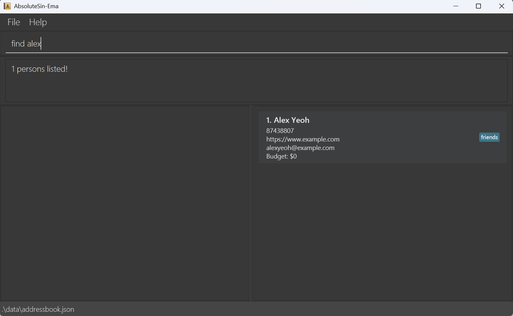

### Listing all tags : `listtags`

Lists all tags currently used in the AbsolutSin-ema.

Format: `listtags`

* The command displays all unique tags across all persons in alphabetical order.
* If no tags exist in the address book, a message will indicate that no tags were found.

Example:
* `listtags` displays all tags such as `colleague`, `friend`, `supplier`, etc.
  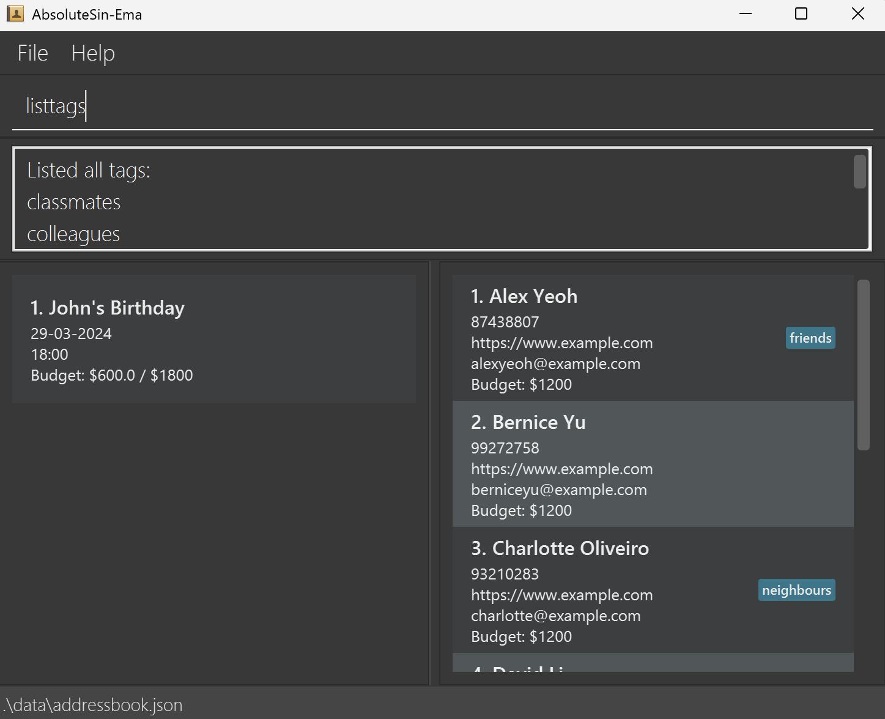

### Deleting a person : `delete`

Deletes the specified person from the AbsolutSin-ema.

Format: `delete INDEX`

* Deletes the person at the specified `INDEX`.
* The index refers to the index number shown in the displayed person list.
* The index **must be a positive integer** 1, 2, 3, …​

Examples:
* `list` followed by `delete 2` deletes the 2nd person in the AbsolutSin-ema.
* `find Betsy` followed by `delete 1` deletes the 1st person in the results of the `find` command.

### Managing parties

AbsolutSin-ema allows you to manage parties (events) and assign contacts to them.

#### Adding a party: `addp`
Adds a party to the party list.

Format: `addp n/NAME d/DATE t/TIME b/BUDGET [c/CONTACT_INDEX ...]`

* You may optionally assign contacts to the party using their indexes.
* The date must be in a valid format (e.g. 12-12-2025).
* The time must be in a valid format (e.g. 18:00).

Examples:
* `addp n/John's Birthday d/12-12-2025 t/18:00 b/5000`
* `addp n/Team Meeting d/01-11-2025 t/14:00 b/2000 c/1,2`

  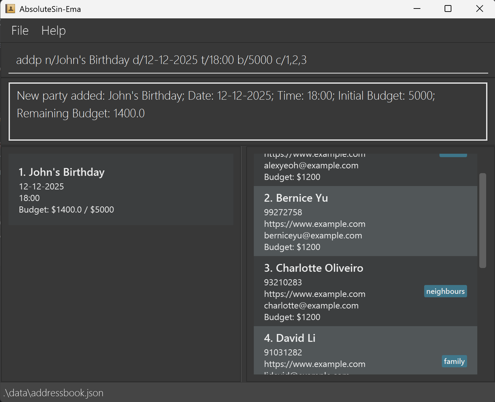

#### Editing a party: `editp`
Edits the details of an existing party.

Format: `editp INDEX [n/NAME] [d/DATE] [t/TIME] [b/BUDGET]`

* Edits the party at the specified `INDEX` in the party list.
* At least one of the optional fields must be provided.

Examples:
* `editp 1 d/13-12-2025 t/20:00 b/5100`
* `editp 2 t/15:00`

  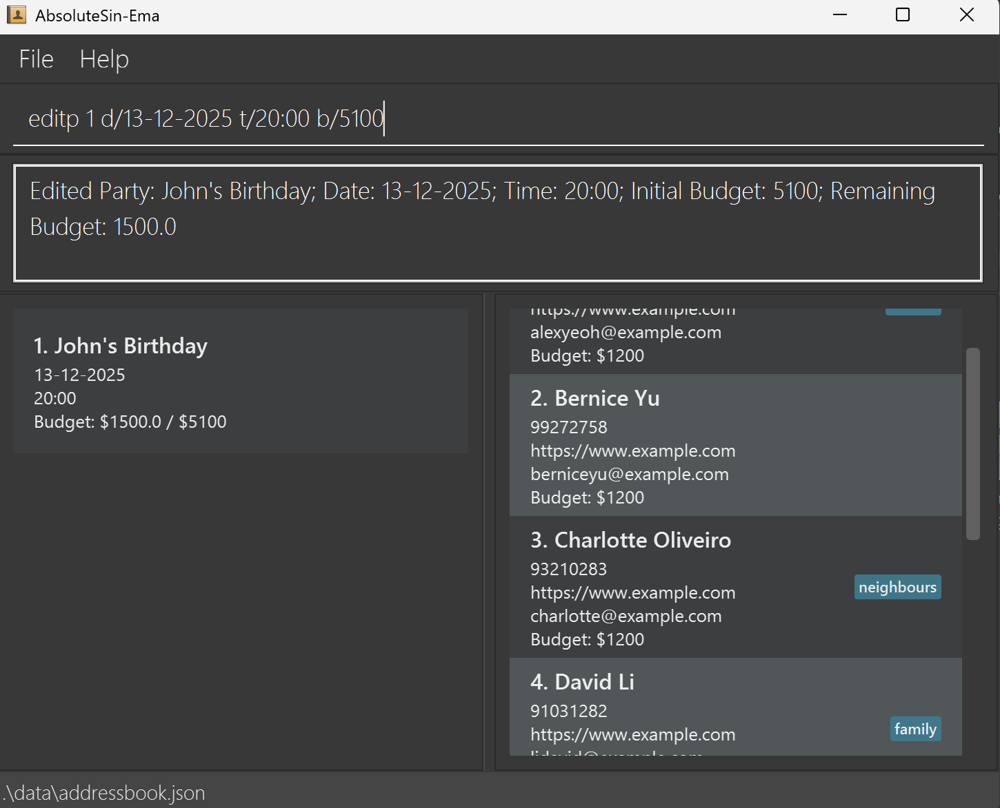

#### Deleting a party: `deletep`
Deletes a party from the party list.

Format: `deletep INDEX`

* Deletes the party at the specified `INDEX` in the party list.

Example:
* `deletep 1`

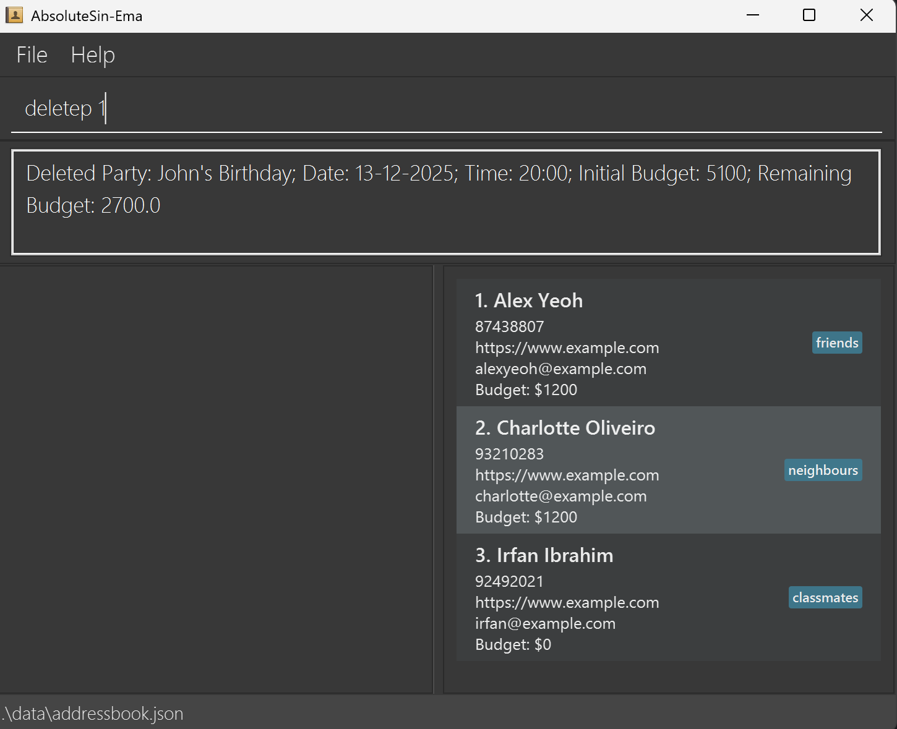

#### Assigning contacts to a party: `assign`
Assigns contacts to a specific party.

Format: `assign INDEX c/CONTACT_INDEX[,CONTACT_INDEX ...]`

* Assigns the specified contacts to the party at the given `INDEX`.
* With each contact added, the budget of the party will be updated.

Example:
* `assign 1 c/5`

  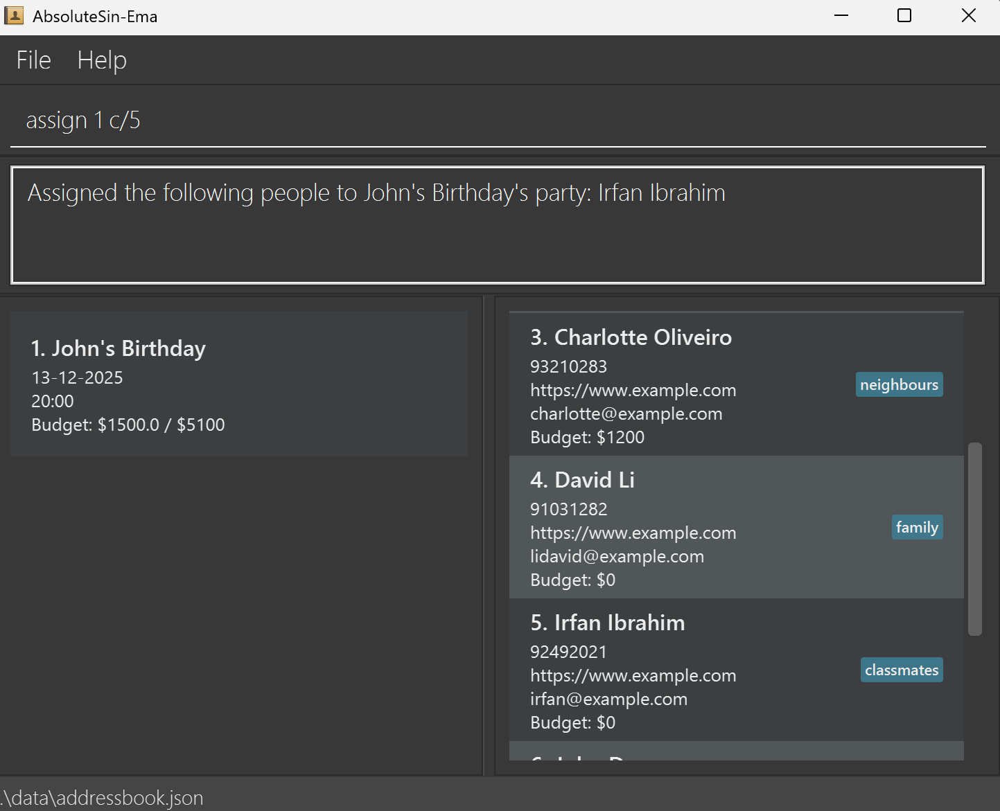

#### Unassigning contacts from a party: `unassign`
Unassigns contacts from a specific party.

Format: `unassign INDEX c/CONTACT_INDEX[,CONTACT_INDEX ...]`

* Unassigns the specified contacts from the party at the given `INDEX`.

Example:
* `unassign 1 c/2`

  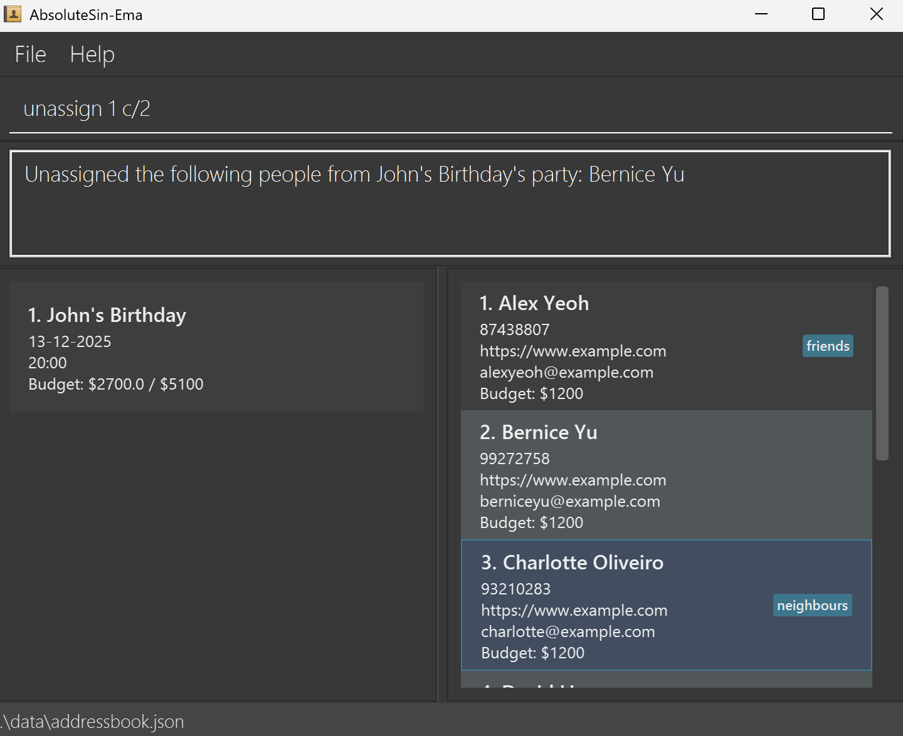

#### Viewing party participants: `view`
Shows all contacts assigned to a party.

Format: `view INDEX`

* Displays all contacts assigned to the party at the specified `INDEX`.

Example:
* `view 1`

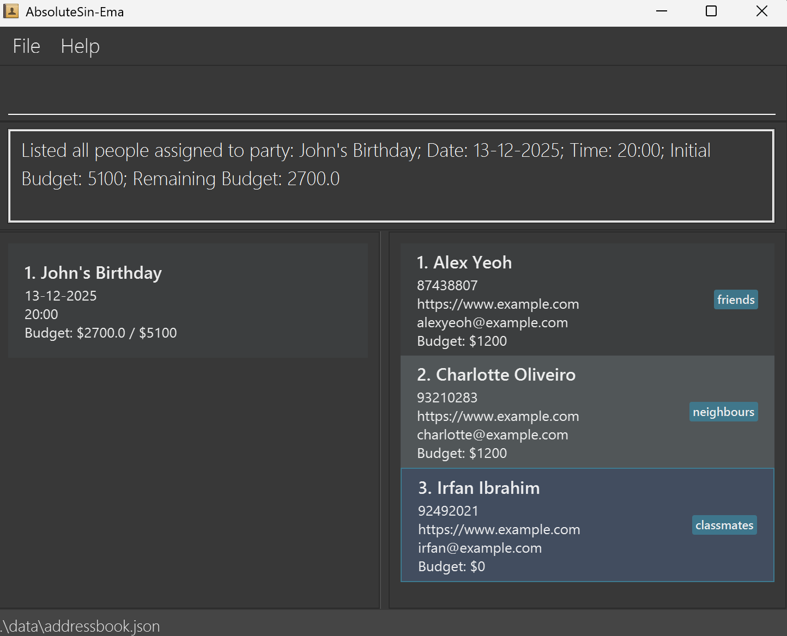

### Clearing all entries : `clear`

Clears all parties, contacts, or both, from the AbsolutSin-ema.

Format: `clear all/parties/contacts`

Upon executing the `clear` command, a confirmation message will appear to prevent accidental data loss. You must confirm the action to proceed.

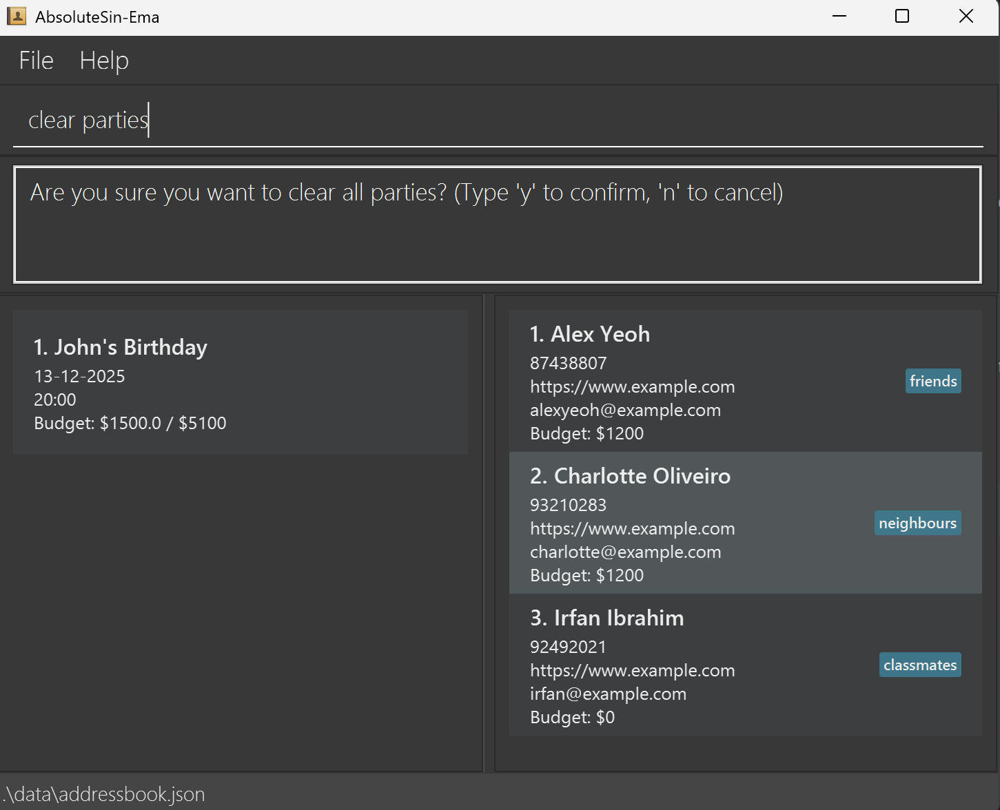
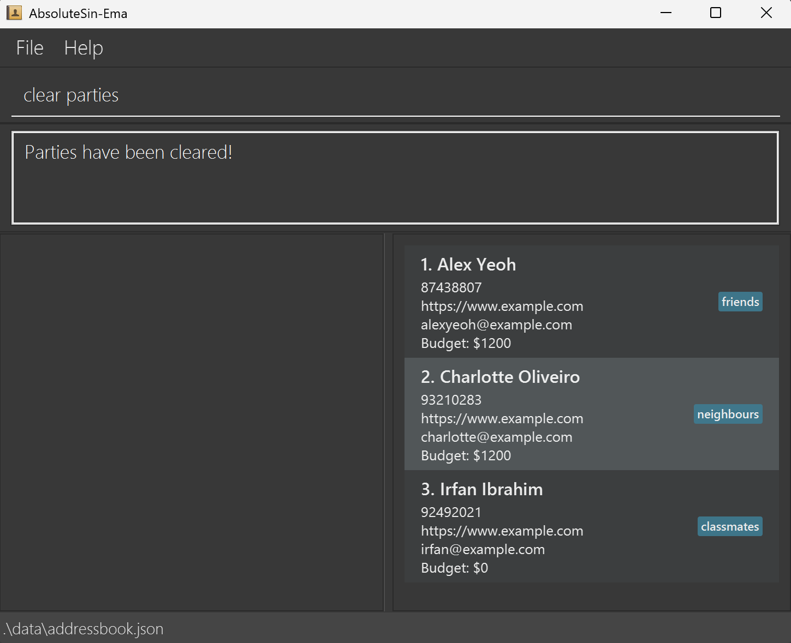

:exclamation: **Warning:**
This will delete ALL contacts permanently. While this action can be undone, it should still be used with caution.

### Undoing the previous command : `undo`

Undoes the most recent add, delete, edit, clear, or any party-related command. This restores AbsolutSin-ema to the state before the last command was executed.

Format: `undo`

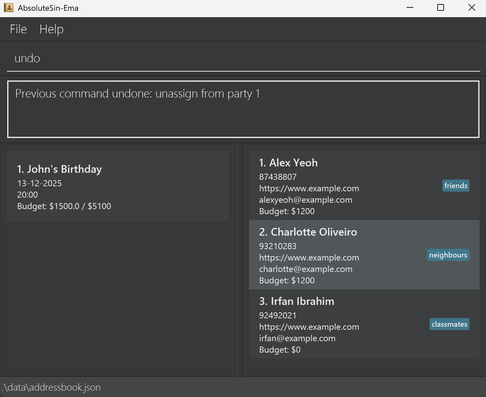

**Commands that can be undone:**
- `add` - Removes the person that was added
- `delete` - Restores the person that was deleted
- `edit` - Restores the person to their previous state
- `clear` - Restores all contacts and/or parties that were cleared
- `addp` - Removes the party that was added
- `editp` - Restores the party to its previous state
- `deletep` - Restores the party that was deleted
- `assign` - Reverts the assignment of contacts to a party
- `unassign` - Reverts the removal of contacts from a party

:information_source: **Note:**
Only one level of undo is supported. You can only undo the most recent command.

:exclamation: **Important:**
Commands like `find`, `list`, `help`, and `exit` do not modify data and therefore cannot be undone. The undo command will only affect the most recent command that actually changed your contacts or parties.

**Examples:**
* After running `addp n/John's Birthday d/12-12-2025 t/18:00 b/5000`, typing `undo` will remove the party from your party list.
* After running `assign 1 c/2`, typing `undo` will unassign contact 2 from the 1st party.
* After running `deletep 2`, typing `undo` will restore the 2nd party back to your party list.

### Exiting the program : `exit`

Exits the program.

Format: `exit`

### Saving the data

AbsolutSin-ema data are saved in the hard disk automatically after any command that changes the data. There is no need to save manually.

### Editing the data file

AbsolutSin-ema data are saved automatically as a JSON file `[JAR file location]/data/absolutsinema.json`. Advanced users are welcome to update data directly by editing that data file.

:exclamation: **Caution:**
If your changes to the data file makes its format invalid, AbsolutSin-ema will discard all data and start with an empty data file at the next run. Hence, it is recommended to take a backup of the file before editing it. 
Furthermore, certain edits can cause the AbsolutSin-ema to behave in unexpected ways (e.g., if a value entered is outside of the acceptable range). Therefore, edit the data file only if you are confident that you can update it correctly.

--------------------------------------------------------------------------------------------------------------------

## FAQ

**Q**: How do I transfer my data to another computer? 
**A**: Install AbsolutSin-ema on the new computer and overwrite the empty data file it creates with the file that contains the data of your previous AbsolutSin-ema home folder. The data file is located at `[JAR file location]/data/addressbook.json`.

**Q**: What happens if I accidentally delete a contact? 
**A**: You can use the `undo` command to restore the deleted contact immediately after the deletion. If you have performed other commands after the deletion, you will need to add the contact again manually.

**Q**: Why can't I find a contact even though I know they exist? 
**A**: The `find` command only searches by name and requires exact word matches. Make sure you're typing the exact words that appear in the contact's name. Use `list` to see all contacts if needed.

**Q**: Can I have two contacts with the same name? 
**A**: No, AbsolutSin-ema does not allow duplicate names. Each contact must have a unique name. If you try to add a contact with an existing name, you will get an error message.

**Q**: What happens if I use `clear contacts` or `clear parties`? 
**A**: `clear contacts` will remove all contacts but keep your parties intact. Any parties that previously had assigned contacts will now show no participants.  
`clear parties` will remove all parties while keeping your contacts untouched. Use `clear all` to remove both.

**Q**: Can I undo a `clear all/contacts/parties` command? 
**A**: Yes. If you accidentally clear data, you can immediately type `undo` to restore everything to its previous state. Only one level of undo is supported.

**Q**: Will clearing parties also delete the contacts assigned to them? 
**A**: No. Clearing parties only removes the party entries. The contacts themselves will remain in the contact list.

**Q**: Can I assign the same contact to multiple parties? 
**A**: Yes. A contact can belong to multiple parties at once. Each party tracks its own list of assigned contacts independently.

**Q**: What if I unassign a contact who is not part of that party? 
**A**: The command will show an error message. Only contacts currently assigned to that specific party can be unassigned.

**Q**: What happens if I use `undo` multiple times? 
**A**: AbsolutSin-ema currently supports only **one level of undo**. Running `undo` again after restoring data will not revert earlier actions.

**Q**: How can I verify that a contact was successfully assigned to a party? 
**A**: After using the `assign` command, run `view INDEX` (where `INDEX` refers to the party) to see the list of assigned contacts.

**Q**: What should I do if the application won't start? 
**A**: Ensure you have Java 17 or above installed. Check that the jar file is not corrupted by re-downloading it. Make sure you're running the command `java -jar absolutsin-ema.jar` from the correct directory. See the [Troubleshooting](#troubleshooting) section for more detailed steps.

**Q**: Can I backup my data? 
**A**: Yes, simply copy the `addressbook.json` file from the data folder to a safe location. You can restore it later by copying it back. It's recommended to backup your data regularly.

**Q**: Are my contacts searchable by phone number or email? 
**A**: Currently, the `find` command only searches by name and tag. To find contacts by other fields, use the `list` command to view all contacts and manually search through them.

**Q**: What characters are allowed in names and addresses? 
**A**: Names can contain letters, numbers, and spaces. Addresses can contain any characters including special symbols, making them flexible for international addresses.

--------------------------------------------------------------------------------------------------------------------

## Known issues

1. **When using multiple screens**, if you move the application to a secondary screen, and later switch to using only the primary screen, the GUI will open off-screen. The remedy is to delete the `preferences.json` file created by the application before running the application again.

--------------------------------------------------------------------------------------------------------------------

## Command summary

Action | Format, Examples
--------|------------------
**Add** | `add n/NAME p/PHONE_NUMBER e/EMAIL [w/WEBSITE] b/BUDGET [t/TAG]…​`   e.g., `add n/James Ho p/22224444 e/jamesho@example.com w/jamesho.com b/500 t/friend t/colleague`
**Add Party** | `addp n/NAME d/DATE t/TIME b/BUDGET [c/CONTACT_INDEX...]`   e.g., `addp n/John's Birthday d/12-12-2025 t/18:00 b/5000 c/1,2`
**Clear** | `clear all/parties/contacts`
**Delete** | `delete INDEX`  e.g., `delete 3`
**Delete Party** | `deletep INDEX`   e.g., `deletep 2`
**Edit** | `edit INDEX [n/NAME] [p/PHONE_NUMBER] [e/EMAIL] [w/WEBSITE] [t/TAG]... [b/BUDGET]`  e.g.,`edit 2 n/James Lee e/jameslee@example.com b/300`
**Edit Party** | `editp INDEX [n/NAME] [d/DATE] [t/TIME] [b/BUDGET]`   e.g., `editp 1 n/John's Birthday d/13-12-2025 t/19:00 b/5200`
**Assign to Party** | `assign PARTY_INDEX c/CONTACT_INDEX...`   e.g., `assign 1 c/1,2,3`
**Unassign from Party** | `unassign PARTY_INDEX c/CONTACT_INDEX...`   e.g., `unassign 1 c/2,3`
**Find** | `find KEYWORD [MORE_KEYWORDS]`  e.g., `find James Jake`
**List** | `list`
**Undo** | `undo`
**Help** | `help`
